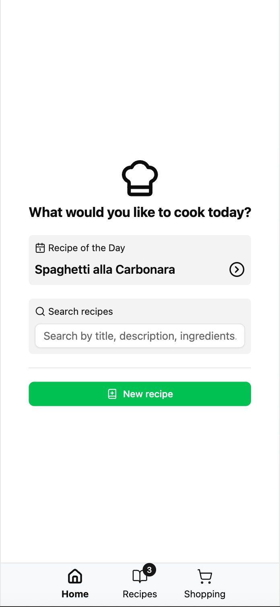
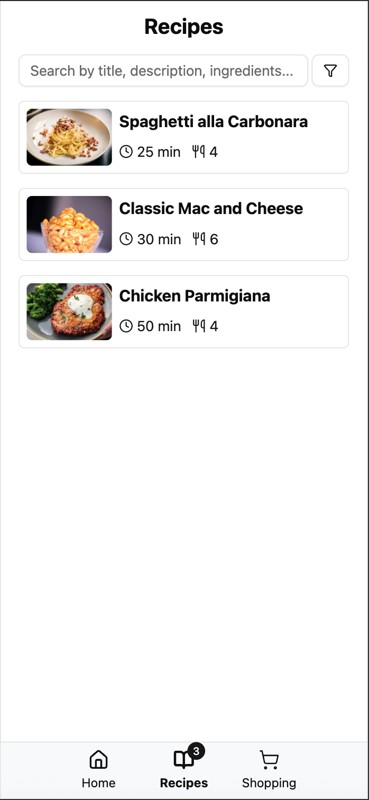
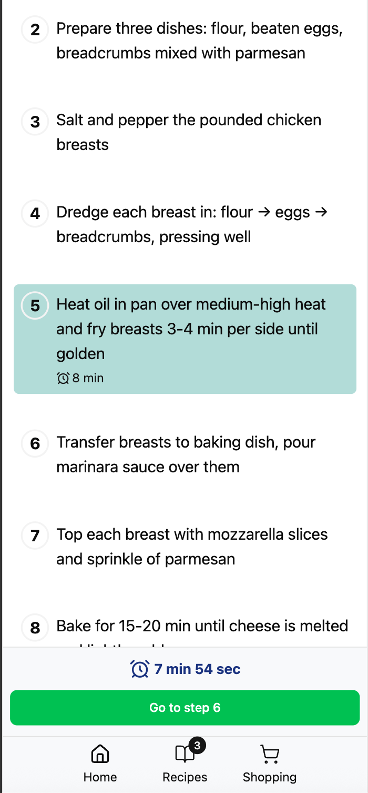
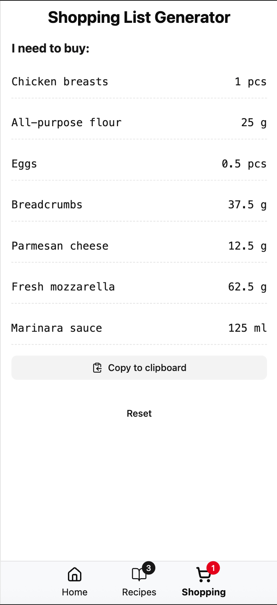

# Motu Novu Recipe Box Assignment






## Introduction

This repository contains frontend code for the Motu Novu Recipe Box assignment.

You can see the initial assignment description in the original document: [FRONTEND_ASSIGNMENT_RECIPE.md](./FRONTEND_ASSIGNMENT_RECIPE.md).

**None of the code or this README were written using AI agents**

You can view live demo at: [https://motunovurecipeboxnm.netlify.app/](https://motunovurecipeboxnm.netlify.app/)

Or, if you want to start locally:

```bash
npm install
npm run dev # or npm run build for production
```

You can also build a Docker image and run it:

```bash
docker build -t recipe-box .
docker run -p 3000:3000 recipe-box
```

## Tech Stack

* React
* TypeScript
* Tailwind CSS
* ShadCN UI
* Vite
* Lucide Icons
* Zustand (state management)
* TanStack Router


**Quick justification for the choices:**

React, TypeScript are self-explanatory and were required.
Vite provides fast development experience and is de-facto standard for modern frontend bundling.

Tailwind CSS + ShadCDN is a very popular choice and I selected them because:

* Many existing rich UI libraries like MUI, Ant Design are hard to customize and it becomes painful to use them if one of the required usecases are not covered. ShadCN on other hand, provides minimal set of components with per-project styling based on Radix Primitives (unopinionated, accessible UI components). If needed, all components could be restyled or even replaced without any significant changes to dependencies or surrounding code - just change the styling inside `src/components/ui` files.
* Tailwind CSS provides quick prototyping, works natively well with ShadCN and generally delivers great DX.

Lucide Icons is just a personal choice, I needed some icon pack with easy to use API and low overhead.

Zustand is very minimalistic state management library, similar to Vue.js Pinia, which I am big fan of. For me, other choices like Redux or MobX are much worse in terms of complexity, mental overhead and boilerplate levels, especially for projects of such scale.

TanStack Router is a modern routing solution from TanStack team, and is much more powerful and easier than React Router, also delivering type-safety out of the box.

## Technical Details

* The app is mobile-first, and has no adaptive desktop design. Desktop version would require quite a lot of effort, and considering that most of potential users will be using mobile devices, I decided to just center the content for larger screens to make it usable for the tiny percent of desktop users.
* App uses localStorage for data persistence, although the code is structured in a way that it mimics usage of real backend API (see `src/api/recipes.ts`). For now, it contains mocked calls to local storage, but in production - these would probably be `fetch` requests to real API. Components and stores are unaware of that detail and "think" that they are talking to API abstraction. There are artificial delays put in these functions to mimic real network calls and demonstrate loading states.
* The app will seed initial 3 recipes on first load. The recipes will be persisted on first modification, like marking as favorite, editing or deleting.
* Worth noting, that layout of recipe view page is very similar and re-implemented on recipe view, recipe cook and recipe edit pages. This is done intentionally, although it could be refactored into using some generic "layout" component that will accept different children for each section or migrating sections like Ingredients or Recipe description into separate components for further re-use.
* No sagas or query libraries were used because I am not a big fan of them and enjoy Vue.js approach of single source of truth and mutations provider to be the store itself, which I tried to apply there.

## Notable UX decisions / nuances

* Bottom navbar is visible at all times to provide instant navigation to desired pages.
* Tapping on "Search" block (despite being an input) on homepage will open recipes page with a focus on search field to provide single interface for recipe browsing and search.
* Editing screen tries to mimic as closely as possible layout of the "view recipe" screen, giving an illusion that all static texts just changed to editable fields. 
* Favorite recipes will appear on top of the list to provide quick access to them, removing the need to generate separate page for "Favorites".
* "Cook recipe" screen allows iterating through recipe ingredients and cooking steps, with built-in timers. Still, static read-only mode can be used for users with such preference.
* Most of theme colors and styles were not modified and are just default ShadCN theme, as I am not an expert designer to be able to create a well-fitting, balanced palette out of the blue. Current code allows to easily modify the theme and restyle the app if there would a good design solution, but the default one works for me as well.
* I am fan of structuring layout using CSS flex and paddings only, as this provides a very close mapping to Figma's layouting, simplifying designer<>developer collaboration, and it has proven in my experience to delivery more understandable and deterministic layout. Therefore, this approach is widely used in the app.

## Challenges and unsolved problems

* Most of typography should only be rendered using a special `<Label size={...} />` component, which would apply correct font size, weight and line height for each use case, basically mapping a design system. For now, most of typography styling is applied in-place with Tailwind classes and may not be consistent.
* I am not sure if top headers with action buttons should be stick or not. For now, they are not to increase reading space.
* Error handling could be done in a better way - most of it dependents on what features will be using backend API and in what way.
* Shopping ingredients are not grouped into categories (diary, vegetables, etc.), like mentioned in the assignment. I am not sure how to do that without using some AI/API or keeping an ingredients database with categories.
* There are no tests, but they were not mentioned in the assignment either. Current code structure allows quite easily testing individual components and some core logic like `lib/ingredients.ts`, so that should not be a problem in potential future.
* Lucide icons do not provide "filled" icons out of the box, which would really improve UI in certain scenarios, like "filled heart" for favorite recipes. It's assumed that such icons could be later added.
* I am very sure that recipe viewing page can be improved for readability, especially instructions section, but I am not sure how exactly.
* Accessibility would be probably the most rough point of the app, requiring more attention and effort.

## Time Spent

Total: about 18-20 hours.

Most time consuming - recipe view and cook pages (about 3 hours each).
Then shopping list generator - about 3 hours as well.